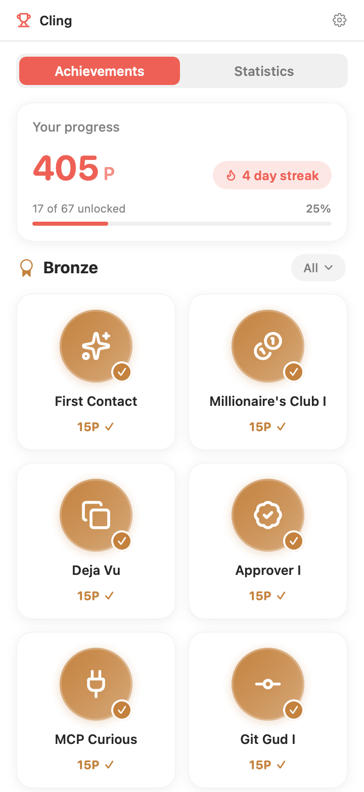
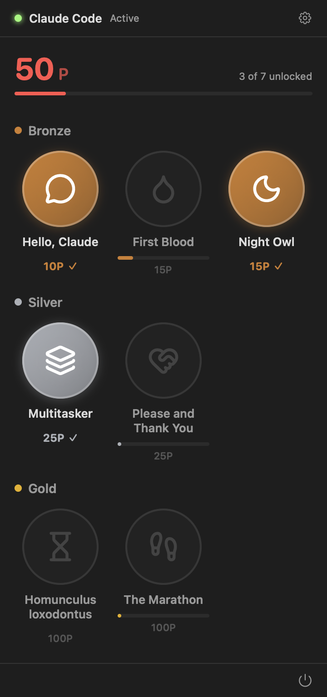
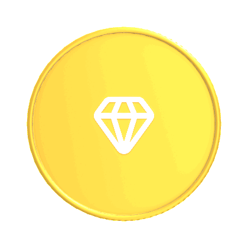
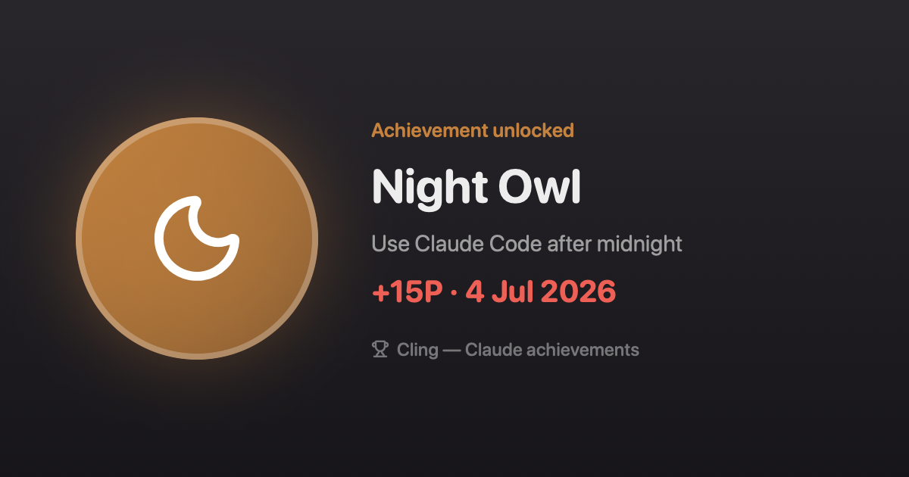

<div align="center">

# 🏆 Cling

### Xbox-style achievements for your Claude Code usage.

Cling quietly watches how you use [Claude Code](https://claude.com/claude-code) and rewards you with
**achievements, points, and a satisfying unlock toast + sound** the moment you hit a milestone.
It's a tiny, native, privacy-first menu bar app that makes your terminal sessions feel like a game.

[](https://www.apple.com/macos/)
[](https://swift.org)
[](LICENSE)
[](https://github.com/Milording/cling/stargazers)

 

</div>

---

## ✨ What is this?

You already spend hours in Claude Code. Cling turns that time into a game. It reads your **local**
Claude Code transcripts, tracks your progress toward a set of achievements, and celebrates every
unlock with an Xbox 360–style toast — including a sound effect — in the corner of your screen.

<div align="center">

</div>

Tap any medal to flip it into a **real 3D coin** — spin it with your mouse, icon on the front, points on the back:

<div align="center">

</div>

## 🎮 Features

- **🏅 Achievement system** — **67 achievements** across Bronze, Silver, Gold, and Platinum tiers, worth 2,125 points, including secret hidden ones.
- **🪙 Spinnable 3D coin medals** — each achievement is a photoreal metal coin (bronze/silver/gold) you can drag to rotate, with inertia.
- **🔔 Xbox-style unlock toasts** — a springy badge animation with a real sound, that you can hover to keep open.
- **🖼️ Shareable cards** — turn any unlocked achievement into a polished image for your socials (vertical *story* and horizontal *post* layouts).
- **🧭 Menu bar native** — a clean, [Numi](https://numi.app)-inspired popover; no Dock icon, no clutter, follows light/dark mode.
- **🟢 Live status** — a dot shows when Claude Code is actively working.
- **🔒 100% local & private** — everything is read from `~/.claude` on your Mac. Nothing is ever sent anywhere. No account, no telemetry, no network calls.
- **🧪 Dev mode** — preview, force-unlock, and inject test events to try every achievement.
- **🪶 Featherweight** — native SwiftUI, zero third-party dependencies, a few MB of RAM.

## 🏆 Achievements

67 achievements, earned live from your local Claude Code activity — a few tastes:

| Tier | Achievement | How to unlock |
|:----:|-------------|---------------|
| 🥉 Bronze | **First Contact** | Send your very first message |
| 🥉 Bronze | **Night Owl I** | Code 10 nights between midnight and 5 AM |
| 🥉 Bronze | **Git Gud I** | 10 git commits |
| 🥈 Silver | **Millionaire's Club II** | Generate 10,000,000 tokens |
| 🥈 Silver | **Weekend Warrior** | Code both days of 10 weekends |
| 🥈 Silver | **Potty Mouth II** | Swear 25 times |
| 🥇 Gold | **Daily Driver III** | A 100-day streak |
| 🥇 Gold | **Car Payment** | $500 of estimated usage |
| 💎 Platinum | **Daily Driver IV** | A 365-day streak |
| 💎 Platinum | **100% Claude Completion** | Unlock everything else |

…plus tiered **Millionaire's Club**, **Thank You Please**, **Doctor**, **Feedback**, **Context Goblin**, **Project Hopper**, **Approver**, **CTRL+C Rage Quit** ladders — and a handful of **🔒 hidden** ones you'll have to discover yourself.

<div align="center">

<br><em>Every unlocked achievement can be shared as an image like this.</em>
</div>

## 🚀 Install

Cling builds from source with the Swift toolchain that ships with Xcode 15+ (Xcode 26 recommended).

```sh
git clone https://github.com/Milording/cling.git
cd cling
scripts/bundle.sh --install     # builds and copies Cling.app to /Applications
open /Applications/Cling.app
```

Or just run it in place:

```sh
scripts/bundle.sh               # builds dist/Cling.app
open dist/Cling.app
```

The app lives only in your menu bar (look for the 🏆). To start tracking, just use Claude Code as usual —
achievements are earned **live** from the moment you first launch Cling (your past history isn't back-filled).

> **Note:** Cling is unsigned/un-notarized open-source software. On first launch macOS may ask you to
> approve it in **System Settings → Privacy & Security**.

### Launch at login

Enable **Launch at login** from the gear menu (requires the app to be in `/Applications`, i.e. installed
with `scripts/bundle.sh --install`).

## 🧠 How it works

Claude Code stores every session as a JSONL transcript under `~/.claude/projects/`. Cling tails those
files, extracts the events it cares about (messages, token usage, timestamps, session IDs), and runs
them through a small, fully unit-tested achievement engine. Progress is saved to
`~/Library/Application Support/Cling/state.json`.

There is **no network layer at all** — Cling never sends your data anywhere.

## 🧪 Dev mode

Turn on **Dev mode** in Settings (the gear icon) to reveal a test panel where you can preview any toast,
force-unlock achievements, reset progress, and inject synthetic events (a 1 AM message, a 31-minute wait,
a full 6-hour marathon, and so on) to exercise the real rules.

## 🛠️ Development

```sh
swift build          # compile
swift test           # run the engine + parser unit tests
scripts/bundle.sh    # assemble dist/Cling.app
```

The project is a plain Swift Package — no `.xcodeproj` required. Everything builds and tests from the CLI.

```
Sources/Cling/
├── Monitor/   # tails ~/.claude transcripts, parses JSONL → events
├── Engine/    # the achievement rules + persistence (pure, unit-tested)
├── Toast/     # the Xbox-style unlock overlay
├── UI/        # menu bar popover, medal grid, settings, dev mode
├── Share/     # social share-card rendering
└── Support/   # sounds, Lucide icons, login item, status
```

## 🗺️ Roadmap

- [ ] Signed & notarized release + Homebrew cask
- [ ] More achievements (streaks, weekend warrior, polyglot…)
- [ ] Claude Desktop as a second tracked source
- [ ] Custom achievement sounds & themes
- [ ] iCloud sync of progress across Macs

Ideas and PRs very welcome — see below.

## 🤝 Contributing

Contributions are welcome! Open an issue to discuss a feature or bug, or send a PR. New achievements are
especially easy to add — they're just small rules in `Sources/Cling/Engine`. Please run `swift test`
before submitting.

## 🙏 Credits

- Icons by [Lucide](https://lucide.dev) (ISC License).
- Popover design inspired by the lovely [Numi](https://numi.app).
- Built for [Claude Code](https://claude.com/claude-code).

## 📄 License

[MIT](LICENSE) © Anton Mitrofanov

---

<div align="center">
<sub>If Cling made your terminal a little more fun, consider leaving a ⭐ — it genuinely helps.</sub>
</div>
